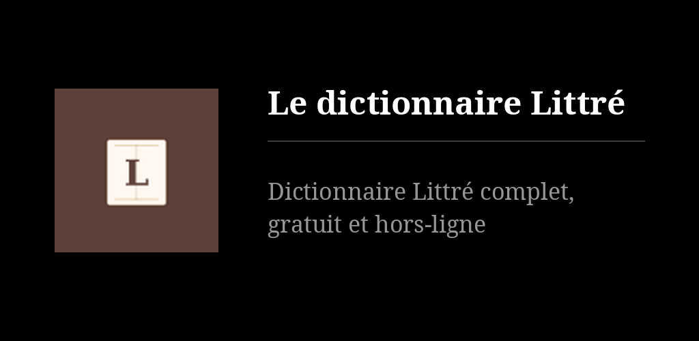
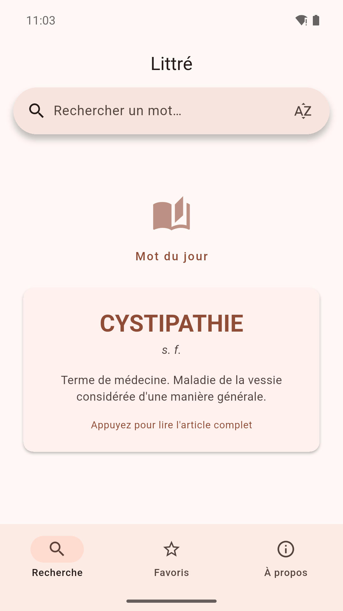
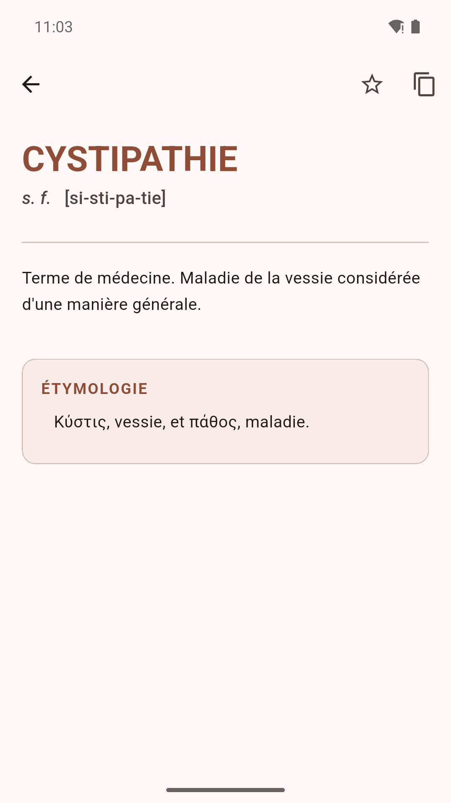
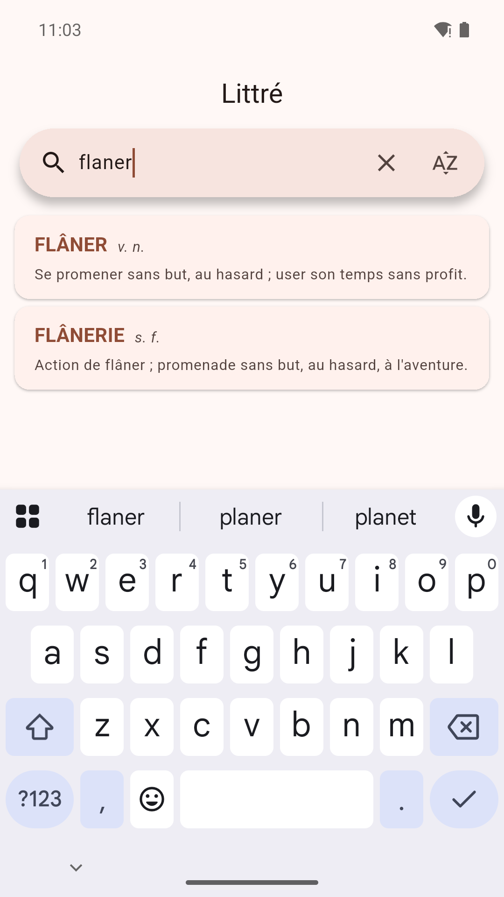

# Littré — Dictionnaire de la langue française

Les 78 599 entrées du dictionnaire d'Émile Littré, avec étymologies et citations, consultables
sans connexion. Recherche instantanée, renvois cliquables, favoris, mot du jour en widget. Ni
publicité ni compte. Données [littre.org](https://www.littre.org) (François Gannaz,
[xmlittre](https://bitbucket.org/Mytskine/xmlittre-data)), CC BY-SA 3.0.

## Points-clés

- Taper le début d'un mot : les entrées s'affichent au fil de la frappe.
- Le bouton à côté du champ bascule entre la recherche par mot et la recherche dans le texte des définitions.
- Dans un article, les renvois s'ouvrent d'un toucher ; l'étoile met le mot en favori.
- Favoris et historique (les 100 derniers mots consultés) restent sur le téléphone.
- Mot du jour dans l'app et en widget d'écran d'accueil ; la tuile de [Reader's Launcher](https://github.com/funkypitt/readers-launcher) l'affiche aussi.
- Aucune permission demandée, pas même Internet : tout le dictionnaire est dans l'app.
- Thème clair ou sombre, selon le système.

## Installer


[](https://gallaz.ch/eink/fr.html#littre-app)

- **F-Droid** (recommandé, les mises à jour arrivent seules) : ajoutez le dépôt depuis [gallaz.ch/eink](https://gallaz.ch/eink/fr.html#fdroid), ou l'adresse `https://funkypitt.github.io/fdroid-repo/repo` dans F-Droid.
- **Obtainium** : touchez le badge depuis le téléphone, ou ajoutez `https://github.com/funkypitt/littre-app` dans Obtainium.
- **APK** : joint à la [dernière version](../../releases/latest). Pas de mises à jour automatiques.

Les trois voies livrent le même fichier, avec la même signature.

## Construction

La base n'est pas dans le dépôt ; il faut la produire avant de compiler :

```bash
cd tools/
git clone https://bitbucket.org/Mytskine/xmlittre-data.git
python3 convert_littre.py xmlittre-data -o ../assets/littre.db
cd .. && flutter pub get && flutter build apk
```

## Crédits

- **Données lexicographiques** : « Le Littré » par François Gannaz — [littre.org](https://www.littre.org) — Licence CC BY-SA 3.0
- **Texte original** : Émile Littré, *Dictionnaire de la langue française*, Paris, Hachette, 1873–1874 (domaine public)

## Crédits / Credits

© 2026 Pierre Gallaz. Développé avec [Claude Code](https://claude.com/claude-code) (Anthropic).
Licence GPL-3.0, voir `LICENSE`.

© 2026 Pierre Gallaz. Developed with [Claude Code](https://claude.com/claude-code) (Anthropic).
GPL-3.0 licence, see `LICENSE`.

## Captures d'écran

  
